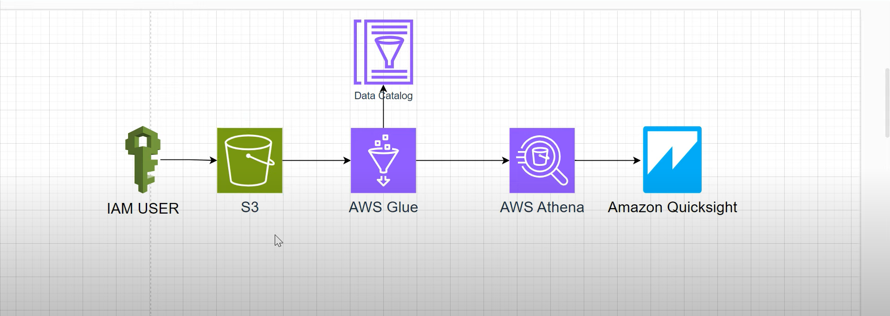

# 🧠 AWS Data Analytics Pipeline using S3, Glue, Athena & QuickSight  

## 📘 Project Overview  
This project demonstrates how to build a **serverless data analytics pipeline** on AWS that ingests raw data into Amazon S3, catalogs it using AWS Glue, queries it with Amazon Athena, and visualizes insights through Amazon QuickSight.  

The goal is to transform raw data into meaningful business intelligence dashboards — **without managing any servers or infrastructure.**

---

## 🏗️ Architecture Diagram  


### **Architecture Flow**
1. **IAM User** – Provides access to AWS services with appropriate permissions.  
2. **Amazon S3** – Acts as a data lake storing raw CSV or JSON files.  
3. **AWS Glue** – Crawls and catalogs S3 data to create a metadata store (Data Catalog).  
4. **AWS Athena** – Performs SQL-based analysis directly on S3 data using the Glue Data Catalog.  
5. **Amazon QuickSight** – Connects to Athena to visualize analytical insights and build dashboards.  

---

## ⚙️ AWS Services Used  

| Service | Purpose |
|----------|----------|
| **IAM** | User authentication & permissions management |
| **Amazon S3** | Central data lake for raw data storage |
| **AWS Glue** | Data Catalog creation & ETL (Extract, Transform, Load) |
| **Amazon Athena** | Serverless querying using SQL |
| **Amazon QuickSight** | Data visualization and dashboard creation |

---

## 🚀 Step-by-Step Implementation  

### 🧩 Step 1: IAM Setup  
- Created an IAM user with full access to **S3**, **Glue**, **Athena**, and **QuickSight**.  
- Configured programmatic access using access keys to upload data to S3.

### 🪣 Step 2: Data Ingestion in S3  
- Uploaded datasets (e.g., `sales_data.csv`) into an S3 bucket.  
- Example structure: s3://my-data-lake/sales_data/sales_data.csv

  
### 🧠 Step 3: AWS Glue – Data Catalog Creation  
- Created a Glue **Crawler** to scan the S3 bucket.  
- Automatically detected schema and stored metadata in the **AWS Glue Data Catalog**.  
- Table created: `sales_data_table`

### 🔍 Step 4: AWS Athena – Querying the Data  
- Used Athena to run SQL queries directly on the S3 data.  
- Example query:
```sql
SELECT region, SUM(sales) AS total_sales 
FROM sales_data_table
GROUP BY region;


Query results stored automatically in another S3 location.

📊 Step 5: Amazon QuickSight – Dashboard Visualization

Connected QuickSight to Athena as a data source.

Built interactive dashboards showing insights such as:

Sales by region

Monthly revenue growth

Top 5 performing products

Category-wise sales comparison

📈 Example Dashboard

Your live QuickSight dashboard (accessible only to authorized users):
🔗 Click to View (Internal QuickSight Dashboard)

📸 (If public access is disabled, include screenshots here instead)

Example visuals to showcase in README:

sales_by_region.png

monthly_growth_trend.png

top_products.png


💡 Key Highlights

✅ 100% Serverless architecture
✅ No ETL servers or manual schema management required
✅ SQL-based analysis using Athena
✅ Dynamic BI dashboards with QuickSight
✅ Highly cost-effective and scalable

🧰 Tools & Technologies

AWS S3 – Object storage

AWS Glue – Metadata catalog & ETL

AWS Athena – Interactive SQL engine

AWS QuickSight – Data visualization

AWS IAM – Access control

🧩 Use Case Example

Imagine you have a dataset like:

Region	Product	Sales	Month
East	Laptop	1000	Jan
West	Mouse	500	Feb

You can visualize insights such as:

Total sales by region

Monthly sales trends

Top products by category

Year-over-year performance

