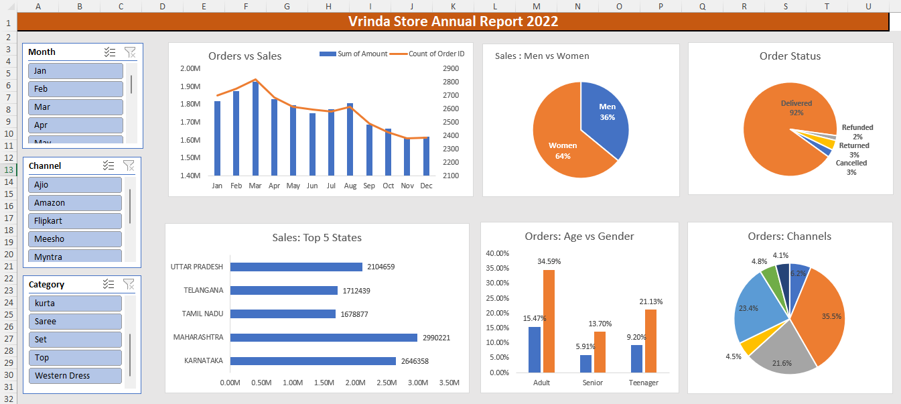

🛍️ Vrinda Store Sales Analysis — Excel Dashboard Project

 <b>Data Analysis | Business Intelligence | Excel Dashboard | Retail Analytics</b> 

📌 Project Summary

This project analyzes retail sales data of Vrinda Store using Microsoft Excel to extract actionable business insights and recommend strategies to increase sales and marketing effectiveness.

The analysis focuses on customer behavior, regional performance, demographic contribution, and sales channel efficiency.

## 🎯 Business Problem

Vrinda Store wanted to identify:

Who are the most valuable customers?

Which regions generate the highest revenue?

Which age groups drive sales?

Which sales channels perform best?

How to target marketing efforts for maximum ROI?

## 🧠 Analytical Approach

✔ Data Cleaning & Preparation
✔ Exploratory Data Analysis (EDA)
✔ Pivot Table Analysis
✔ KPI Identification
✔ Visualization & Dashboard Creation
✔ Insight Generation
✔ Business Recommendation

## 🛠️ Tools & Skills Demonstrated

Tools

Microsoft Excel

Pivot Tables

Pivot Charts

Slicers

Conditional Formatting

Skills

Data Cleaning

Data Analysis

Business Intelligence

Retail Analytics

Data Visualization

Insight Generation

Decision Support

## 📂 Dataset Description

The dataset contains order-level transactional data including:

Customer Gender

Age Group

State

Sales Channel (Amazon, Flipkart, Myntra, etc.)

Order Amount

Order Status

Product Category

📊 Key Performance Insights
👩 Gender-Based Analysis

Women contribute approximately 65% of total purchases

Female customers are the primary revenue drivers

## 🗺️ State-Wise Analysis

Top-performing states:

Maharashtra

Karnataka

Uttar Pradesh

These states contribute approximately 35% of total sales

## 👥 Age Group Analysis

The 30–49 years age segment contributes approximately 50% of revenue

This is the most economically active customer group

## 🛒 Sales Channel Analysis

Major contributing platforms:

Amazon

Flipkart

Myntra

Together they contribute approximately 80% of total revenue

🏆 Final Business Recommendation
🎯 Target Segment Strategy

To maximize sales growth:

👉 Focus on women customers aged 30–49 years
👉 Located in Maharashtra, Karnataka, and Uttar Pradesh
👉 Promote products via Amazon, Flipkart, and Myntra

## 📢 Marketing Actions

Targeted digital advertising

Personalized offers & coupons

Festival campaigns

Marketplace promotions

## 📈 Expected Business Impact

Implementing these recommendations can:

✔ Increase conversion rates
✔ Optimize marketing spend
✔ Improve customer acquisition
✔ Boost revenue growth
✔ Enhance decision-making

## 📊 Dashboard Features

Interactive Pivot Dashboard

Region-wise Performance View

Demographic Analysis

Channel Contribution Analysis

Clean Business-Friendly Visualizations

## 🚀 How to Use

Download the Excel file from this repository

Open in Microsoft Excel (2016 or later recommended)

Navigate to dashboard sheet

Use slicers to interact with data

## 🔮 Future Enhancements

Build interactive dashboard in Power BI

Add time-series trend analysis

Customer segmentation using RFM

Predictive sales modeling

SQL-based data pipeline

## 👨‍💻 Author

Girish Hakki
Aspiring Data Analyst

📌 Skills: Excel | SQL | Power BI | Data Analysis
📌 Open to Data Analyst & MIS Executive roles

⭐ If you found this project useful

Give this repository a ⭐ to support my work!
